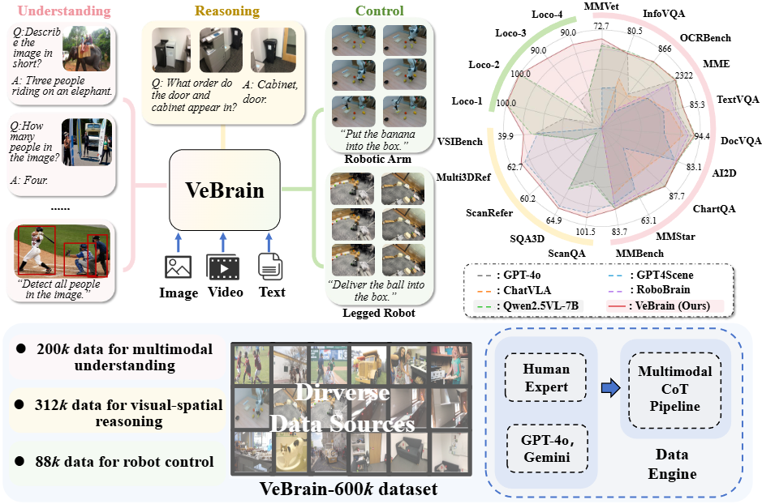
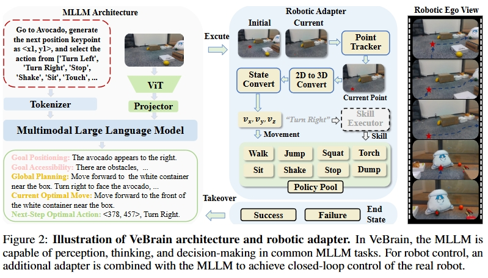

# Visual Embodied Brain: Let Multimodal Large Language Models See, Think, and Control in Spaces

 [[📜 Paper]](https://internvl.github.io/blog/2025-05-26-VeBrain/) [[⭐️Project Page]](https://internvl.github.io/blog/2025-05-26-VeBrain/) [[🤗 Model]](https://huggingface.co/OpenGVLab/VeBrain) 
 <!-- [[📝 Chinese Post]](https://mp.weixin.qq.com/s/FmjG0Gp5ow7mm2Vzd9ppPg) -->

<!--   -->
<!--   -->
<!--  -->

## ⭐️ Introduction

The remarkable progress of Multimodal Large Language Models (MLLMs) has attracted increasing attention to extend them to physical entities like legged robot. This typically requires MLLMs to not only grasp multimodal understanding abilities, but also integrate visual-spatial reasoning and physical interaction capabilities. Nevertheless, existing methods struggle to unify these capabilities due to their fundamental differences. In this paper, we present the <b>V</b>isual <b>E</b>mbodied <b>Brain</b> (<b>VeBrain</b>), a unified framework for perception, reasoning, and control in real world. VeBrain reformulates robotic control into common text-based MLLM tasks in the 2D visual space, thus unifying the objectives and mapping spaces of different tasks. Then, a novel robotic adapter is proposed to convert textual control signals from MLLMs to motion policies of real robots. From the data perspective, we further introduce VeBrain-600<i>k</i>, a high-quality instruction dataset encompassing various capabilities of VeBrain. In VeBrain-600<i>k</i>, we take hundreds of hours to collect, curate and annotate the data, and adopt multimodal chain-of-thought (CoT) to mix the different capabilities into a single conversation. Extensive experiments on 13 multimodal benchmarks and 5 spatial intelligence benchmarks demonstrate the superior performance of VeBrain to existing MLLMs like Qwen2.5-VL. When deployed to legged robots and robotic arms, VeBrain shows strong adaptability, flexibility, and compositional capabilities compared to existing methods. For example, compared to Qwen2.5-VL, VeBrain not only achieves substantial gains on MMVet by +5.6%, but also excels in legged robot tasks with +50% average gains.

## 🎫 License

This project is released under the [MIT License](LICENSE).